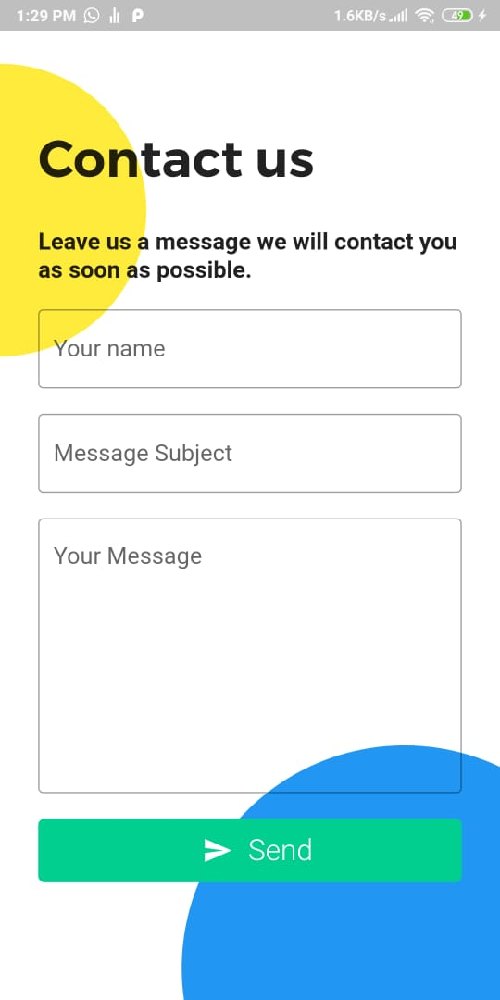

# NewsApp

simple news application using free news API for fetching realtime data from the internet.

# Donwload link 

https://drive.google.com/file/d/1d2OiHr9M8SWLqKaXfrMMNRTljuPhfiAJ/view?usp=sharing

# Features
- Saving articles to favorite list.
- Ability to remove articles from favorite list.
- Explore latest news based on category.
- Showing articles using flutter webview.
- Local storage using sqflite.

# Screenshots

## Api source

- https://newsapi.org/

## Getting Started

This project is a starting point for a Flutter application.

A few resources to get you started if this is your first Flutter project:

- [Lab: Write your first Flutter app](https://flutter.dev/docs/get-started/codelab)
- [Cookbook: Useful Flutter samples](https://flutter.dev/docs/cookbook)

For help getting started with Flutter, view our
[online documentation](https://flutter.dev/docs), which offers tutorials,
samples, guidance on mobile development, and a full API reference.
